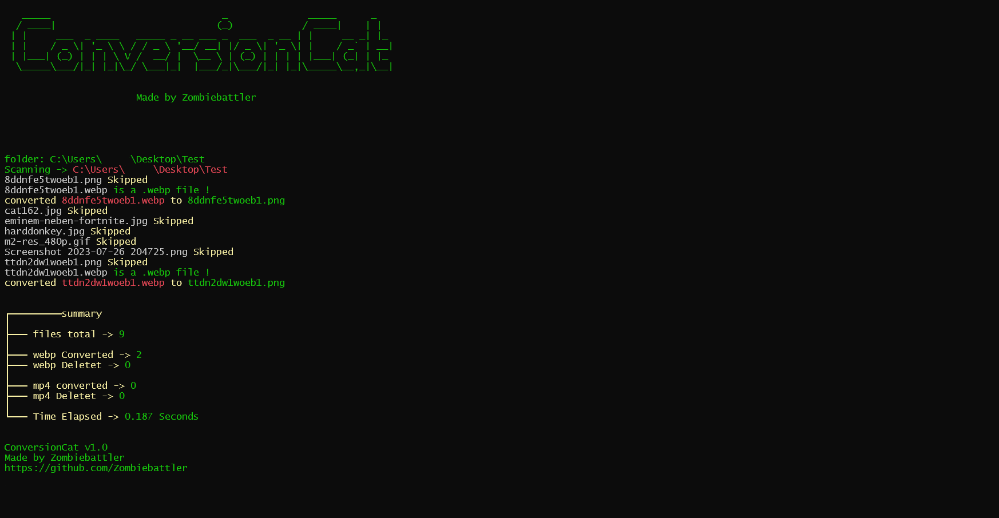

#  ConversionCat

ConversionCat is an efficient script designed to facilitate the seamless conversion of files within directories. Whether you have a vast collection of documents, images, or media files that need transformation, this program offers a simple and intuitive solution to automate the process, saving you valuable time and effort.

## !!! there are currently some bugs when converting specific file types !!!

## Supported image formats
(September 2021)

> 1.  JPEG (`.jpg`, `.jpeg`)
> 2.  PNG (`.png`)
> 3.  BMP (`.bmp`)
> 4.  GIF (`.gif`) - Note: GIF support is limited to basic GIFs. Animated GIFs are not fully supported.
> 5.  TIFF (`.tif`, `.tiff`)
> 6.  WebP (`.webp`)
> 7.  ICO (`.ico`)
> 8.  PPM (`.ppm`)
> 9.  PGM (`.pgm`)
> 10.  PBM (`.pbm`)
> 11.  PCX (`.pcx`)
> 12.  TGA (`.tga`)
> 13.  EXR (`.exr`)
> 14.  PDF (`.pdf`) - Note: Support for PDF is limited to opening and manipulating individual pages.
> 15.  PSD (`.psd`) - Note: Support for PSD is limited to basic parsing.

 [PIL Documentation](https://pillow.readthedocs.io/)

## Supported video formats
(September 2021)

> 1.  mp4 (H.264 codec) (`.mp4`)
> 2.  avi (`.avi`)
> 3.  webm (`.webm`)
> 4.  GIF (`.gif`)
> 5.  mov (`.mov`)
> 6.  mkv (`.mkv`)
> 7.  wmv (`.vmv`)
> 8.  mpeg (`.mpeg`)

[MoviePy Documentation](https://github.com/Zulko/moviepy/)
